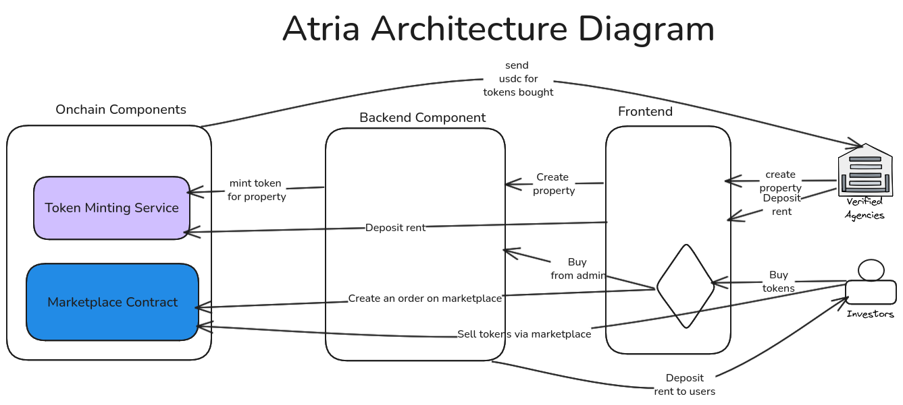

# Atria Documentation

## Table of Contents

- [Project Title and Track](#project-title-and-track)
- [Pitch Deck and Certification Links](#pitch-deck-and-certification-links)
- [Hedera Integration](#hedera-integration)
  - [1. Hedera Token Service](#1-hedera-token-service)
  - [2. Hedera Smart Contract Service](#2-hedera-smart-contract-service)
  - [3. Hedera Mirror Node REST API](#3-hedera-mirror-node-rest-api)
- [Transaction Types](#transaction-types)
- [Economic Justification](#economic-justification)
- [Deployment & Setup Instructions](#deployment--setup-instructions)
- [Architecture Diagram](#architecture-diagram)
- [Deployed Hedera IDs](#deployed-hedera-ids)
- [Problem](#problem)
- [Solution (The Hook)](#solution-the-hook)
- [Value Proposition](#value-proposition)
- [Impact](#impact)

---

## Project Title and Track

**Project Title:** Atria  
**Track:** Onchain Finance & Real-World Assets

---

## Pitch Deck and Certification Links

- **Pitch Deck URL:** [https://pitch.com/v/atria-pitch-mwmnrv](https://pitch.com/v/atria-pitch-mwmnrv)
- **Certification Links:**
  - [Patrick Ojiambo](https://certs.hashgraphdev.com/64b80932-d3f7-4e98-a6a1-2e2356238bf5.pdf)

---

## Hedera Integration

The code interacting with the Hedera services below is in the `site/smartcontract` folder.

### 1. Hedera Token Service

We used the **Hedera Token Service (HTS)** to power Atria’s real estate tokenization and transactions.  
HTS enables us to mint property-backed tokens, transfer ownership seamlessly, and set up allowances (approvals) for secure operations between users and marketplace contracts. We also used HTS to associate tokens to the marketplace contract.

We chose HTS because it provides native, low-cost, and highly efficient token management on the Hedera network, without the complexity of custom smart contracts. It ensures speed, transparency, and security when creating and managing fractional real estate assets, making it ideal for a platform that handles frequent, high-volume micro-investments.

---

### 2. Hedera Smart Contract Service

We used the **Hedera Smart Contract Service (HSCS)** to deploy and manage Atria’s Marketplace smart contract.  
Through HSCS, we handle all core marketplace logic, including executing transactions, calling smart contract functions, and querying on-chain data ensuring that the marketplace runs entirely on a transparent, decentralized infrastructure.

We chose HSCS because it offers high performance, low fees, and strong security, all while maintaining full compatibility with Solidity and the Ethereum Virtual Machine (EVM). This allows us to leverage familiar development tools while benefiting from Hedera’s speed, stability, and predictable costs, making it ideal for real estate transactions that demand both trust and efficiency.

---

### 3. Hedera Mirror Node REST API

We used the **Hedera Mirror Node REST API** to access real-time on-chain data from the Hedera network.  
Through this API, Atria can query token balances, verify whether a token is associated with an account or contract, and track transaction histories all in a fast and reliable way.

We chose the Mirror Node REST API because it provides lightweight, real-time access to Hedera’s state data without the need to run a full node. This allows us to build a responsive and data-driven user experience while maintaining transparency, accuracy, and performance essential for users to trust that their property tokens and investments are being tracked correctly.

---

## Transaction Types

1. TokenCreateTransaction
2. TokenBurnTransaction
3. TransferTransaction
4. ContractExecuteTransaction
5. ContractCallQuery
6. Wagmi functions for user to use MetaMask to interact with smart contracts and tokens.

---

## Economic Justification

Hedera’s low and predictable transaction fees make our project financially sustainable.  
Since Atria covers the cost of distributing rent payments to property investors and minting new property tokens, maintaining low operational costs is crucial.  
The predictable nature of Hedera’s fees allows us to operate profitably while keeping investment requirements accessible — even as low as $1.  
This cost-efficiency ensures that agencies and property managers can confidently distribute rent to multiple fractional owners without being burdened by unpredictable or prohibitive network costs.

---

## Deployment & Setup Instructions

_(To be filled in with specific setup steps.)_

---

## Architecture Diagram

---

## Deployed Hedera IDs

_(List deployed IDs here.)_

---

## Problem

Across Africa, **fewer than 10% of people can afford to invest in real estate**.  
In Nairobi, for example, an average apartment costs **over $60,000**, while the **average monthly income is below $400** — putting property ownership far out of reach for most.

These are some of the key challenges holding back real estate accessibility:

- **High entry barriers:** Capital requirements make property investment exclusive to the wealthy.
- **Cumbersome processes:** Lawyers, paperwork, and lengthy due diligence make transactions slow and expensive.
- **No liquidity:** Once you invest, your money is locked for years with no easy exit.
- **Limited access for foreigners:** International investors face complex, restrictive procedures to buy Kenyan real estate.

---

## Solution (The Hook)

**Atria** is a decentralized real estate investment platform that makes property ownership accessible, transparent, and global.

Here’s how Atria solves the problem:

- **Tokenized ownership:** Properties are fractionalized into digital tokens representing real value.
- **Instant liquidity:** Investors can buy or sell their shares anytime on-chain.
- **Trustless transparency:** Every transaction and ownership record is verified on the blockchain.
- **Global access:** Foreign investors can easily purchase and trade Kenyan real estate securely through Atria.

---

## Value Proposition

> **Atria** makes real estate investment in Africa accessible to everyone by enabling users to own and trade fractions of properties for as little as $1, powered by Hedera’s low-cost, transparent, and scalable blockchain network.

---

## Impact

Atria bridges the gap between traditional real estate and blockchain technology, turning property ownership from an exclusive privilege into an **inclusive, borderless opportunity** for all.
